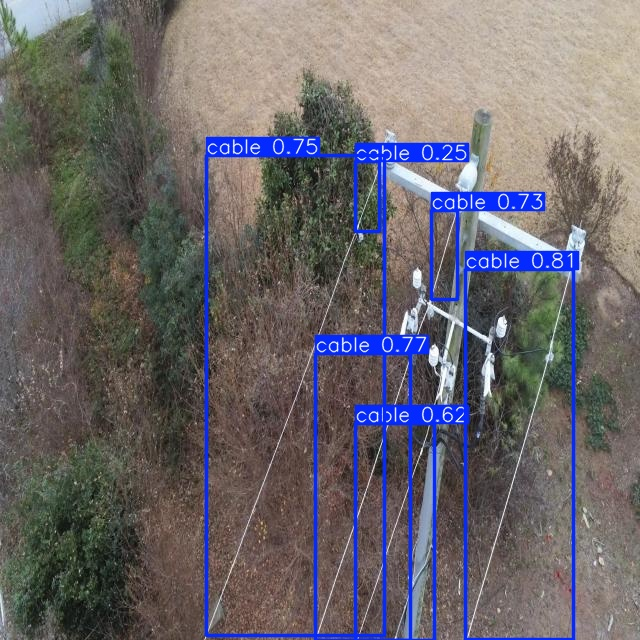

# LV Conductor Detection from Aerial Imagery

Automatic detection of low-voltage conductors and overhead power line components from aerial RGB imagery using YOLOv8n.

Built as a proof-of-concept for AI-enabled infrastructure asset mapping, directly relevant to utility network inspection and hidden conductor inference.

## Problem

Manual inspection of LV networks is slow, costly, and inconsistent. This pipeline detects conductors automatically from aerial RGB imagery using a fine-tuned deep learning model.

## Approach

- YOLOv8n fine-tuned on 2,386 labelled aerial power line images
- Automatic cable detection and bounding box localisation
- Confidence scoring per detection
- Runs on CPU, no GPU required

## Results

| Metric | Value |
|--------|-------|
| mAP@50 | 61.4% |
| Precision | 73.8% |
| Recall | 56.2% |
| Epochs | 15 |
| Training images | 2,386 |

## Sample Detection



## Setup

```bash
pip install ultralytics roboflow
python src/detect.py --image your_image.jpg
```

## Dataset

Aerial power line imagery from Roboflow Universe. 1,815 images, single class: cable.

## Author

Lakshan Divakar — github.com/Lakshan-D
